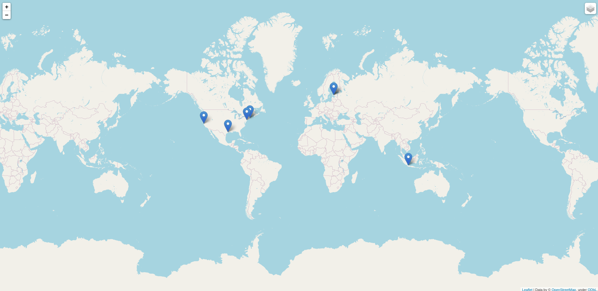

# Map generator

link to **PythonAnywhere**: http://daria.pythonanywhere.com/

This is a web application that creates a map with twitter users. One should input username and bearer token and s/he will get a map with people that user follows.

## Example of usage
1. Input username and token

1. Get the map

1. The user can access maps later and delete them if s/he wants

